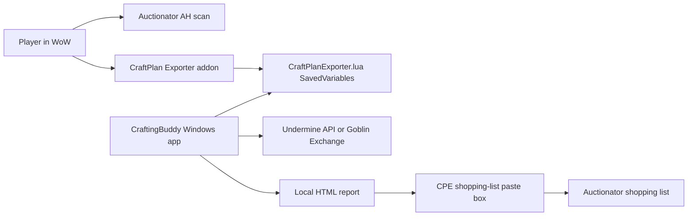

# Architecture

CraftingBuddy has three local pieces: a WoW addon, a Windows helper app, and a generated HTML report.

## Addon Boundary

`CraftPlanExporter/` is a standalone WoW addon.

Responsibilities:

- Open a small in-game panel from the minimap.
- Show the CraftingBuddy minimap texture from `CraftPlanExporter/Media/CraftingBuddyIcon.tga`.
- Ask CraftSim for recipe/profit/variant data.
- Save a full tested variant blob to `CraftPlanExporterDB`.
- Save player realm metadata and current concentration when available.
- Accept shopping-list payloads from the report and create Auctionator lists.

Non-goals:

- Do not patch CraftSim.
- Do not patch Auctionator.
- Do not scrape websites from inside WoW.
- Do not try to be a full profession UI replacement.

## Helper App Boundary

`app/craft-plan-app.mjs` is a local Node HTTP app that opens in the user's browser.

Responsibilities:

- Find or let the user select the WoW folder.
- Install `CraftPlanExporter` into `_retail_\Interface\AddOns`.
- Read `CraftPlanExporter.lua` after `/reload`.
- Detect player realm/region from addon metadata.
- Store optional Undermine API key locally.
- Fetch or refresh market snapshots.
- Generate the report.
- Check GitHub Releases for a newer `CraftPlanApp.exe`.
- Download a release asset into `updates/` and, when running as the packaged exe, restart to replace the app.
- Protect local API routes with a per-launch browser token plus loopback host/origin checks.

Storage:

- `craft-plan-app.config.json` next to the executable/source checkout.
- `data/` next to the executable/source checkout for refreshed market snapshots.
- `report/` next to the executable/source checkout for generated reports.
- `runtime/` next to the executable/source checkout for packaged script extraction.
- `updates/` next to the executable/source checkout for staged updater downloads.

## Update Boundary

The updater only trusts the public GitHub Releases feed for `KacperNowicki/CraftingBuddy`.

Updater flow:

1. `GET /api/update/check` reads the latest GitHub release.
2. The app compares the release tag with the local `package.json` version.
3. `POST /api/update/download` downloads the release asset named exactly `CraftPlanApp.exe` into `updates/`.
4. The staged download is recorded in `updates/latest.json` with size, version, source release, and SHA-256.
5. `POST /api/update/apply` works only in the packaged exe. It starts a small PowerShell script, exits the running app, copies the staged exe over the current exe, and starts it again.

Source mode can check and download updates for testing, but it cannot replace source files.

## Branding Assets

Icon sources live in `assets/icons/` and are generated by `scripts/generate-icons.ps1`.

Generated outputs:

- Candidate SVG/PNG files for visual review.
- `assets/icons/craftingbuddy-icon.svg` and `.png` for the selected app icon.
- `assets/icons/craftingbuddy-icon.ico` for the Windows executable.
- `CraftPlanExporter/Media/CraftingBuddyIcon.tga` for the WoW minimap button.

`scripts/build-exe.ps1` runs `pkg` and then stamps the `.ico` into `dist/CraftPlanApp.exe` with `resedit-cli`.

## Market Sources

Preferred source:

- Undermine API, when the user provides a key.

Fallback source:

- Goblin Exchange data, without a key.

The app should keep the source visible in the UI and report because price/movement confidence depends on it.

## Report Boundary

`scripts/build-craft-plan.mjs` builds:

- `report/craft-plan-report.html`
- `report/craft-plan-report.json`

The report is intentionally static. It embeds the calculated JSON so it can be opened locally or served by the helper app.

Report responsibilities:

- Show batch crafts separately from concentration crafts.
- Rank concentration variants by budget fit and profit per expected concentration, using CraftSim-style Ingenuity refund math when exported.
- Show market confidence using movement and stock.
- Preserve exact reagent quality in craft paths and shopping-list payloads.
- Hide dense optimizer tables by default.

## Trust Model

CraftingBuddy is local-first. It reads local WoW files and calls market APIs from the user's machine.

Secrets:

- Undermine API keys are never committed.
- Saved keys are protected with Windows user-scope protection where available.
- Status APIs must never return the raw key.

Paths:

- WoW folder selection must point to a folder containing `_retail_`.
- Addon install writes only to `_retail_\Interface\AddOns\CraftPlanExporter`.

Local app API:

- Helper API routes require a per-launch token embedded into the served app page.
- The server rejects non-loopback host/origin headers and does not expose wildcard CORS.
- The generated report can call **Regenerate** only when served by the helper app, because the app injects the current token into `/report`.

Profit:

- Profit is a calculation from current scan data, not a promise.
- The UI should surface movement/stock confidence wherever it recommends spending gold or concentration.
